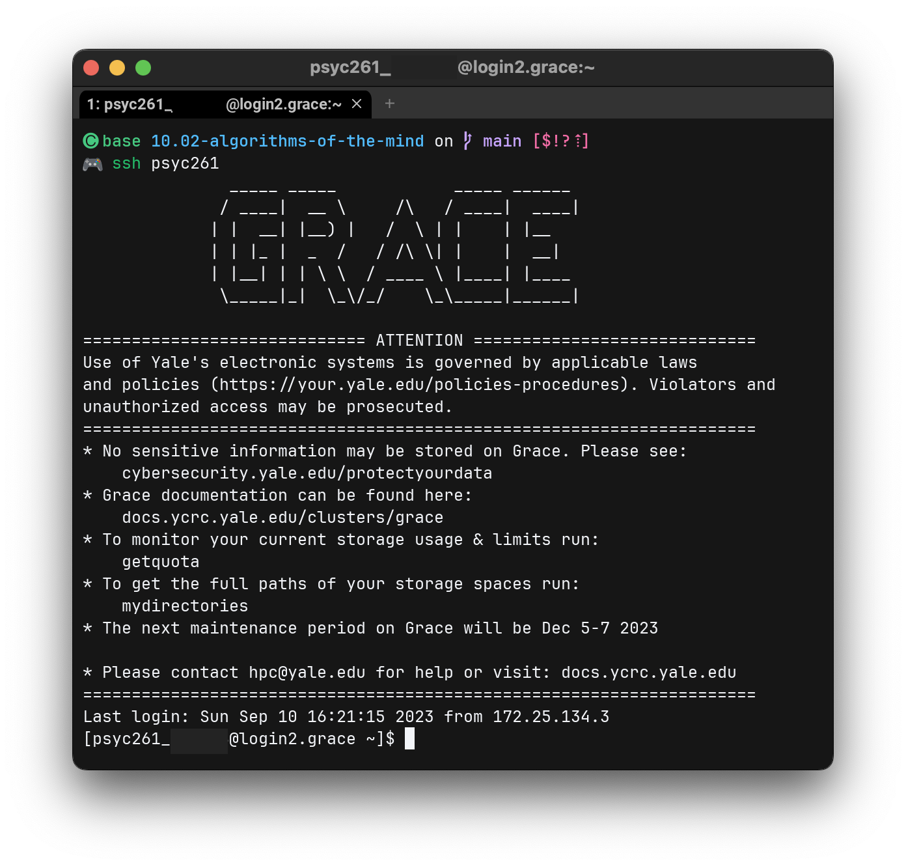
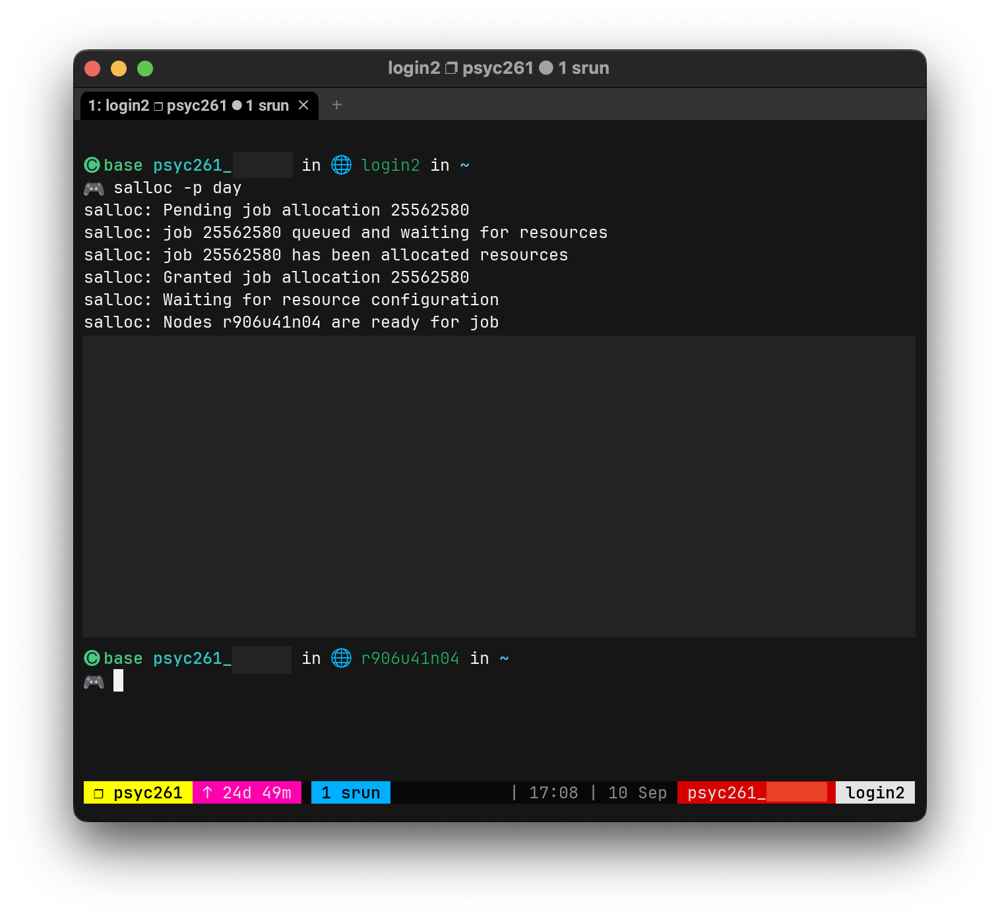

import { LinkCard } from "@astrojs/starlight/components";

Open OnDemand (OOD) provides a graphical interface to start, notably, Jupyter Notebooks on the cluster. This will be the primary way in which we will develop and execute code in this course.

YCRC provides a specific OOD server (which differs from the common URL listed on their website).

<LinkCard
    title="Algorithms of the Mind's OOD Server"
    description="You will login using your NetID and must be on Yale Secure or the Yale VPN"
    href="https://psyc261.ycrc.yale.edu"
    />

## Shell access

**Using OOD:**

1. Click "Clusters" on the main menu, then click ">_Grace Shell Access"
2. A new tab will open, with you logged in to a Grace **login node**.
   You **must not** attempt computation on a login node.

**Using your own Terminal:**
1. Open a Terminal emulator (Terminal.app, WezTerm, iTerm2.app, etc.)
2. SSH with username `psyc261_<netID>` where `<netID>` is your NetID.
   ```shell
   $ ssh psyc261_<netID>@grace.ycrc.yale.edu
   ```

In either case, you should see a prompt like the following image.



**Take note that the login node is `loginX.grace`.** (Where `X` is just a number.)

## Starting an interactive compute session

**Before we begin, we need a way to persist compute sessions across SSH logins.** We will be using `tmux` to do this.

### Aside: `tmux`

When using a remote terminal, we strong recommending using a ["terminal multiplexer"](https://en.wikipedia.org/wiki/Terminal_multiplexer). This will allow you to persist your terminal session across SSH logins! (This means your terminal session will persist through accidental logouts, connection failures, and the like.)
Typically, you would need to restart a terminal session on each login, but with `tmux`, you can avoid this (so long as the computer running `tmux` does not reboot).

<LinkCard
    title="YCRC's guide to tmux"
    description="To learn more about tmux from YCRC"
    href="https://docs.ycrc.yale.edu/clusters-at-yale/guides/tmux"
    />

To create a new `tmux` session, gain shell access (alluded to earlier) and verify that you're on a login node.

Create a new `tmux` session, we'll call it `psyc261`.
```shell
$ tmux new -s psyc261
```

If you have previously created a `tmux` session, you can reattach it using the following command:
```shell
$ tmux a -t <session-name>
```
If you used a `<session-name>` of `psyc261`, then use that as your session name. Otherwise, `tmux` will assign a numeric index for the session, starting from `0`.

To list your active `tmux` sessions, do so using:
```shell
$ tmux ls
```

### Requesting an interactive compute session

In your `tmux` session, request an interactive session using
```shell
$ salloc -p day
```

You should see a similar output to the following:


_This is a slightly customized version of `tmux`, so you'll see something that closely mirrors the first screenshot, but the relevant information is here._

Attend the hostname. Previously, you saw `login2.grace`, which means this user was logged into a login node. Now it says `r906u41n04.grace`, this is the compute node's hostname. **Keep track of this, as it will be what we replace `<compute-node-id>` with!**